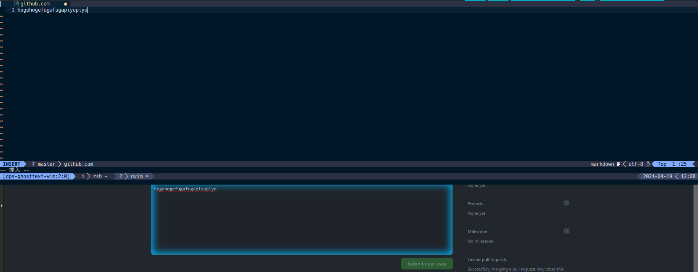

# dps-ghosttext.vim

WIP: GhostText plugin for denops.vim

## Requirements

- [denops.vim](https://github.com/vim-denops/denops.vim) is installed.

## Usage

`:GhostStart`

## LICENSE

[MIT](./LICENSE)
